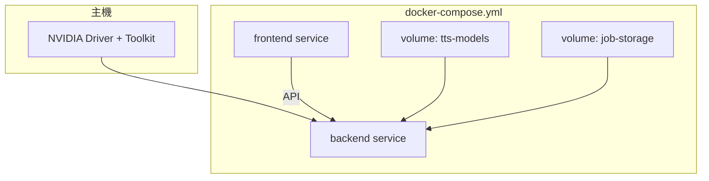

# Docker Compose、GPU 後端與前端容器化

## Overview

在 repo 根目錄與 `backend/`、`frontend/` 建立 Docker 與 Compose 規格，讓開發者能以可重現方式啟動全端 stack；後端容器須支援 **NVIDIA GPU**（PyTorch CUDA）與 **CPU 後備**，並透過 **Compose profile** 區分 dev（bind mount 原始碼）與 prod-like（映像內建程式）；模型／快取預設 **具名 volume**，文件說明如何改為 bind。滿足 origin 之 R1–R7 與成功標準。

## Problem Frame

後端於 `backend/app/main.py` 在 `torch.cuda.is_available()` 為真時使用 `cuda` 載入 XTTS，否則使用 `cpu`；依賴見 `backend/requirements.txt`。目前 repo **尚無** `docker-compose.yml` 與各 `Dockerfile`，貢獻者缺乏單一入口啟動環境。本計畫將「如何建映像、如何掛載、如何開 GPU」落到可執行的檔案與說明，而不改變 API 契約（見 Scope）。

## Requirements Trace

- R1. 根目錄 `docker-compose.yml`（檔名依 origin，除非 Key Decisions 另定）。
- R2. `backend/Dockerfile`、`backend/docker-entrypoint.sh`。
- R3. `frontend/Dockerfile`。
- R4. NVIDIA GPU 路徑：主機驅動 + Container Toolkit + 容器內 CUDA 相容之 GPU PyTorch。
- R5. 不強制 `nvidia/*` 基底映像；以相容性為準選擇基底與安裝方式（see origin）。
- R6. CPU 後備與文件化的 GPU／CPU 啟動方式。
- R7. profile 區分 dev／prod-like；模型／快取預設具名 volume + 文件說明 bind；`STORAGE_ROOT` 持久化（見 Context）。

## Scope Boundaries

- 不實作 Apple Silicon MPS 專用映像（origin）。
- 不涵蓋雲端 K8s／託管服務之正式拓樸與 Ingress。
- 不修改 FastAPI 路由或語音推論邏輯，除非發現現有啟動方式與容器 **無法** 銜接（此時應縮小為環境變數或啟動參數層級的調整）。

## Context & Research

### Relevant Code and Patterns

- 應用入口與生命週期：`backend/app/main.py`（`lifespan` 內載入 TTS、`cuda`／`cpu`）。
- 環境與儲存：`backend/app/config.py` 之 `get_storage_root()`（`STORAGE_ROOT`，預設 `backend/storage`）、`get_cors_allowed_origins()`（預設含 `http://localhost:5173`）、`COQUI_TOS_AGREED` 於 import TTS 前設定（`main.py`）。
- 前端：`frontend/package.json` 使用 Vite（`dev` 於 5173、`build` 產靜態資源）。
- 測試：`backend/tests/conftest.py` 以 mock 隔離 torch／TTS；容器化 **不** 要求改測試策略，但 CI 可維持現有 pytest（主機或 CPU 映像）。

### Institutional Learnings

- `docs/plans/2026-03-31-003-feat-job-storage-plan.md` 與 `STORAGE_ROOT` 一致：Compose 應掛載可寫的 storage volume 或 bind，對齊 `get_storage_root()`。

### External References

- 實作時對照：NVIDIA Container Toolkit 安裝與 Compose v2 的 GPU 設定（`deploy.reservations.devices` 或文件建議之 `runtime`／`device` 寫法，依 Docker Engine 版本選擇）。
- PyTorch 官方文件：CUDA 與 wheel／container 映像對應表（實作單元內敲定具體標籤）。

## Key Technical Decisions

- **基底與 PyTorch**：優先選擇「單一維護路徑」——例如官方 **PyTorch CUDA 映像**或 **Ubuntu + pip 安裝 `--index-url` 的 cu 版 torch**——並在計畫實作中鎖定一組主版本；以通過 `torch.cuda.is_available()` 與後端啟動日誌 `device: cuda` 為驗收（see origin）。不強制 `FROM nvidia/cuda`（R5）（see origin: `docs/brainstorms/2026-04-10-docker-gpu-compose-requirements.md`）。
- **Compose profile 命名**：建議 `dev`（bind mount `backend`、`frontend` 原始碼；可選 node_modules／venv 處理策略於實作註記）與 `prod-like`（不掛原始碼，驗證「與映像一致」行為）（see origin）。
- **GPU 服務標記**：後端服務在 GPU profile 下宣告 GPU 資源；CPU 變體可使用同一 Dockerfile 搭配「僅 CPU 的 torch 安裝」之 **build target** 或 **第二個 target**／第二個 service，以避免在無 GPU 機器上拉 CUDA 層（細節於實作單元內定案；若採單一映像則文件須說明 CPU 機器仍可使用 `cpu` 執行但映像體積較大）。
- **docker-entrypoint.sh**：以 **啟動 uvicorn** 為主（與現有 `uvicorn` 依賴一致），可選擇性處理 `exec`、訊號轉發；**無資料庫遷移**則不引入空遷移步驟（see origin 之 Deferred）。
- **前端映像**：prod-like 採 multi-stage：`npm ci` → `npm run build` → 以靜態伺服（nginx 或 `vite preview` 僅供非正式用途）；dev profile 可 `docker compose run` 前端服務為 `vite` dev server 並掛載原始碼。

## Open Questions

### Resolved During Planning

- **模型／快取路徑**：透過環境變數將 HuggingFace／Torch／Coqui 快取導向已掛載的 volume 路徑（例如 `HF_HOME`、`TORCH_HOME` 等，以實際函式庫讀取為準），與具名 volume 掛載點一致。
- **CORS**：容器網路下前端來源可能為 `http://localhost:5173` 或 compose 服務名；文件與預設 `CORS_ALLOWED_ORIGINS` 需對齊實際 URL。

### Deferred to Implementation

- **精確 CUDA 小版本與映像標籤**：依實作當下 PyTorch 2.6+ 與主機驅動相容表選定。
- **CI 是否建 Docker／CPU-only 管線**：降低成本之選項，非 R1–R3 硬性交付物。

## High-Level Technical Design

> *本節為審查用方向說明，非可直接複製的實作規格。*

- **dev profile**：bind mount `backend` → 容器內工作目錄；bind mount `frontend`；後端掛載具名 volume 至快取目錄與（若需要）`STORAGE_ROOT`。
- **prod-like profile**：不 bind 原始碼；映像內含 build 結果；同樣掛載具名 volume 或宣告持久化需求。

## Implementation Units

- [ ] **Unit 1：後端 `Dockerfile` 與 `docker-entrypoint.sh`**

**Goal：** 可建置後端映像；啟動時執行 FastAPI 應用；支援 GPU 與 CPU 建置策略之一（單檔多 stage 或明確註記兩種 target）。

**Requirements：** R2、R4、R5、R6

**Dependencies：** 無

**Files:**
- Create: `backend/Dockerfile`
- Create: `backend/docker-entrypoint.sh`
- Create: `backend/.dockerignore`（建議，略過 `__pycache__`、`.venv`、`storage` 大量測試資料等）
- Test: 無自動化測試檔（見下）

**Approach：**
- 選定 Python 版本與基底（與 `backend/requirements.txt` 相容）。
- GPU 變體：安裝含 CUDA 的 torch／torchaudio（勿使用預設 CPU-only index）。
- 設定工作目錄與非 root 使用者（若可行且與掛載權限無衝突）。
- `docker-entrypoint.sh`：`exec` 執行 uvicorn（模組路徑與本機慣例一致，例如 `app.main:app`），將訊號傳給子行程。

**Patterns to follow：**
- 環境變數語意見 `backend/app/config.py`、`backend/app/main.py`。

**Test scenarios：**
- Test expectation: none — 以 **Verification** 之建置與執行抽樣驗證取代單元測試。

**Verification：**
- `docker build` 成功；容器啟動後健康檢查或日誌可見應用 listen；在 GPU 主機上日誌顯示 `device: cuda`，在無 GPU 主機顯示 `device: cpu`。

---

- [ ] **Unit 2：根目錄 `docker-compose.yml`（含 profile、volume、GPU）**

**Goal：** 單一 Compose 定義後端、前端服務與網路；`dev`／`prod-like` profile；後端 GPU 與 volume 宣告。

**Requirements：** R1、R4、R6、R7

**Dependencies：** Unit 1、Unit 3（服務名與埠可與 Unit 3 一併對齊）

**Files:**
- Create: `docker-compose.yml`
- Modify：若需略調 CORS 說明，僅限 `README` 或 `docs/`（見 Unit 4），不強制改 `config.py` 預設值。

**Approach：**
- 定義 `backend`、`frontend` 服務、共用 network。
- `dev`：volumes 掛載 `backend`、`frontend` 原始碼；後端掛載具名 volume 至模型／快取路徑；`STORAGE_ROOT` 指向 volume 或 bind（與 R7、job storage 一致）。
- `prod-like`：移除原始碼 bind，使用 build 映像。
- GPU：在 GPU 啟動路徑為後端加上裝置保留（語法依 Docker 版本）；CPU 路徑不請求 GPU。
- **Profile 組合**：實作時固定一種敘述並寫入 Unit 4——要嘛以單一 profile（例如 `dev` 內含 GPU 宣告、另檔 override 做 CPU），要嘛以多 profile 組合（例如 `docker compose --profile dev --profile gpu up`）；避免「文件範例」與實際 `profiles:` 定義不一致。
- 埠對外暴露：後端 API 埠、前端 dev 或 nginx 埠與 `get_cors_allowed_origins()` 一致。
- **e2e 驗證時機**：完整 stack（瀏覽器可打 API）需 Unit 1–3 交付後再驗證，單有 compose 不足以代表前後端映像皆可用。

**Patterns to follow：**
- 現有本機慣例（Vite 5173、FastAPI 常見 8000，以專案實際為準）。

**Test scenarios：**
- Happy path：`docker compose --profile dev up` 可連線前端與後端 health／語音流程（手動）。
- Edge case：無 GPU 主機使用 CPU 路徑仍可 `up` 後端（可能較慢）。
- Error path：未安裝 Toolkit 時，文件說明預期錯誤與降級為 CPU compose 指令。

**Verification：**
- **dev／prod-like** 兩種 profile 皆可啟動（此處指原始碼掛載策略維度，與下項 GPU／CPU 維度正交）。
- 在 **GPU 可用** 的 compose 路徑上，後端日誌確認 `cuda`；在 **僅 CPU** 路徑確認 `cpu`。
- volume 重建容器後模型不需完整重下載（抽樣確認）。

---

- [ ] **Unit 3：`frontend/Dockerfile`**

**Goal：** 可建置前端靜態資源並以伺服行程提供；供 `prod-like` 使用。

**Requirements：** R3

**Dependencies：** 無（與 Unit 2 整合時對齊埠與 build context）

**Files:**
- Create: `frontend/Dockerfile`
- Create: `frontend/.dockerignore`（建議：`node_modules`、`dist`）

**Approach：**
- Multi-stage：依 `package.json` 鎖定 Node 版本；`npm ci` 與 `npm run build`；最終 stage 使用輕量 web server 提供 `dist`。

**Patterns to follow：**
- `frontend/package.json` 之 `build` script。

**Test scenarios：**
- Happy path：映像內靜態檔可透過瀏覽器開啟並呼叫後端（手動整合測試）。
- Test expectation: none for isolated Dockerfile layer — 行為與 Unit 2 一併驗證。

**Verification：**
- `docker build -f frontend/Dockerfile frontend` 成功；頁面載入無 404。

---

- [ ] **Unit 4：操作說明與進階 volume（bind 模型快取）**

**Goal：** 滿足成功標準：新進者可依文件完成 GPU／CPU 啟動與 GPU 驗證；說明如何將具名 volume 改為 bind。

**Requirements：** R6、R7 與 Success Criteria（origin）

**Dependencies：** Unit 2 完成後撰寫，避免指令與實際 compose 不一致。

**Files:**
- Modify：根目錄 `README.md` **或** Create：`docs/docker.md`（擇一為主、另一可短連結；避免兩處長篇重複）

**Approach：**
- 前置條件：NVIDIA 驅動、Container Toolkit、Docker Compose v2。
- 指令範例：`--profile dev`／`prod-like`、GPU 與 CPU 變體。
- 驗證步驟：檢視後端日誌 `device: cuda` 或 `cpu`。
- 進階：將模型 volume 改為主機路徑 bind 的範例片段。

**Patterns to follow：**
- 專案既有 README 語氣與章節結構。

**Test scenarios：**
- Test expectation: none — 文件正確性透過「照文件執行一遍」驗證。

**Verification：**
- 另一位開發者可在乾淨環境依文件完成首次啟動（可內部抽樣）。

## System-Wide Impact

- **Interaction graph：** 瀏覽器 → 前端 → 後端 `clone-voice` 等路由；CORS 與 compose 對外埠需一致。
- **Error propagation：** GPU 不可用時應優雅降級 `cpu`，與現有 `main.py` 一致；Compose 不應在 CPU 模式下仍強制 `nvidia` runtime。
- **State lifecycle risks：** `STORAGE_ROOT` 與 volume 權限（uid／gid）需文件化，避免寫入失敗。
- **Unchanged invariants：** HTTP API 與現有測試行為不改變；僅新增容器與文件。

## Risks & Dependencies

| 風險 | 緩解 |
|------|------|
| 映像體積過大、建置過慢 | 多 stage、.dockerignore、可選 pre-built base |
| 主機驅動與容器 CUDA 不匹配 | 文件中連結官方相容表；提供已知可行標籤 |
| bind mount 覆蓋權限問題 | dev 文件說明 uid 或命名 volume 預設 |

## Documentation / Operational Notes

- 主機需安裝 NVIDIA Container Toolkit 才能使用 GPU 路徑。
- 可選：於 `.gitignore` 確認本機 `storage` 測試資料不被誤掛載策略干擾（若已有則不變）。

## Sources & References

- **Origin document:** [docs/brainstorms/2026-04-10-docker-gpu-compose-requirements.md](docs/brainstorms/2026-04-10-docker-gpu-compose-requirements.md)
- Related code: `backend/app/main.py`, `backend/app/config.py`, `frontend/package.json`
- Related plan: `docs/plans/2026-03-31-003-feat-job-storage-plan.md`（`STORAGE_ROOT`）
